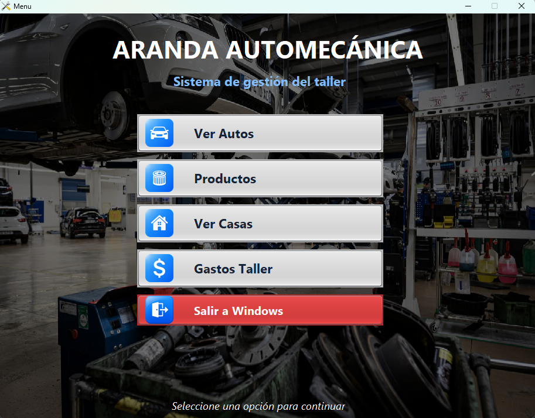
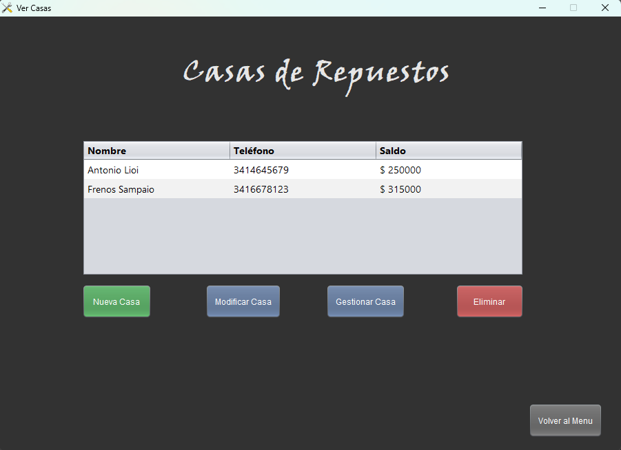
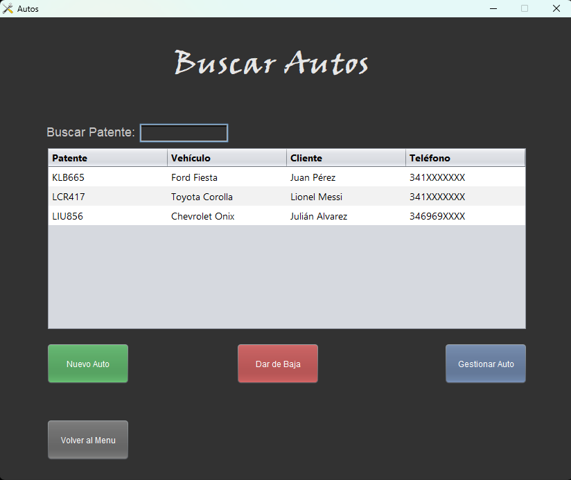
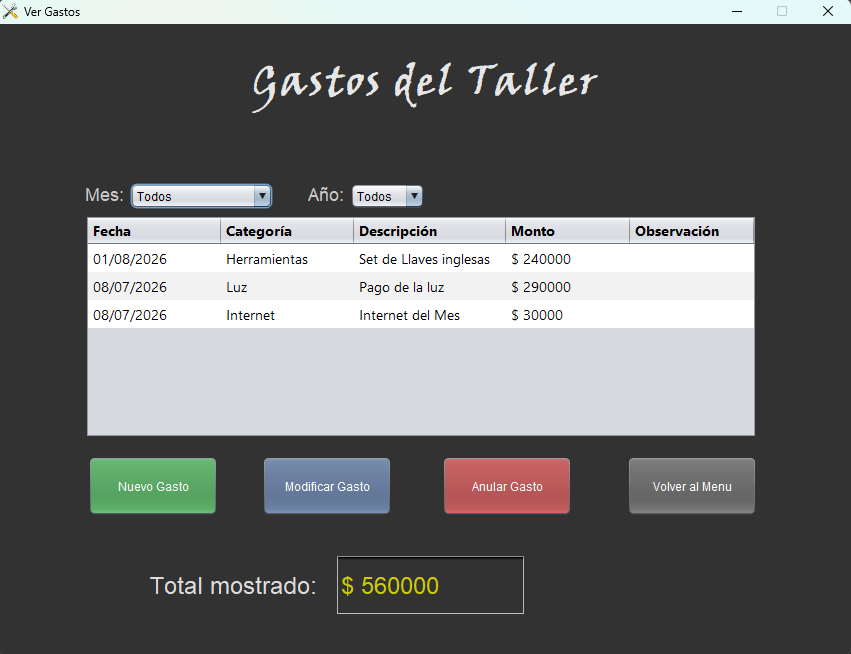
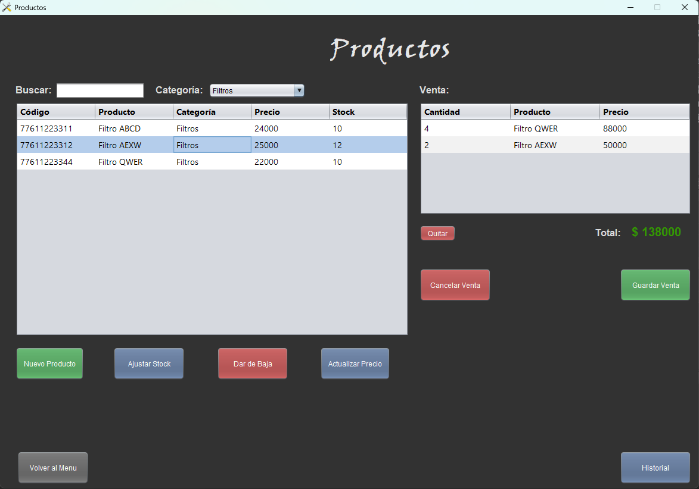
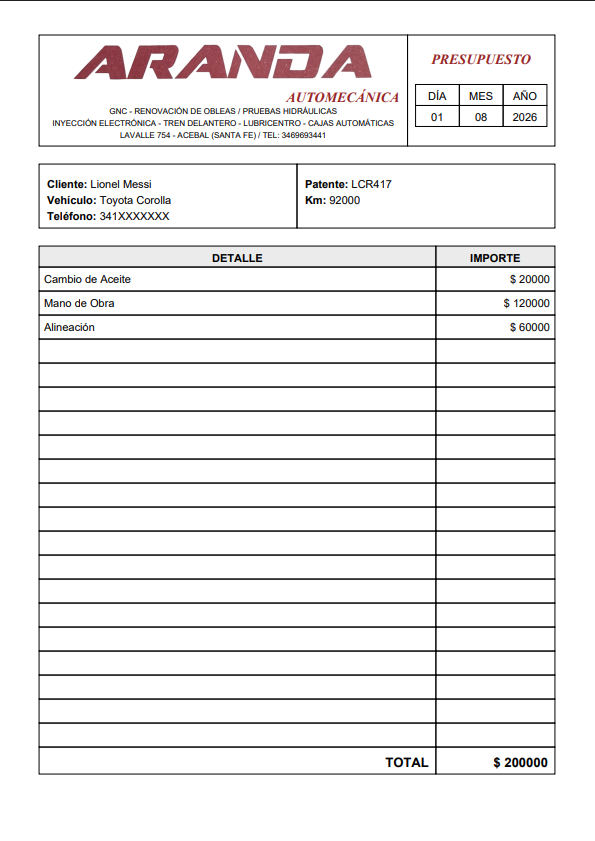

# Sistema de Gestión para Taller Mecánico

Aplicación de escritorio desarrollada en **Java 8** con **Java Swing** y **MariaDB**, diseñada para optimizar la administración integral de un taller mecánico.

Este sistema fue desarrollado para un **cliente real** con el objetivo de centralizar en una única aplicación la gestión diaria del negocio, permitiendo administrar clientes, vehículos, reparaciones, presupuestos, productos, compras, ventas y gastos.

Una de sus funcionalidades principales es el registro de reparaciones realizadas a cada vehículo y la generación automática de presupuestos en formato PDF, facilitando el seguimiento de cada trabajo y mejorando la organización del taller.

---

# Objetivo

Muchos talleres mecánicos pequeños administran la información de clientes, vehículos, reparaciones y stock mediante anotaciones manuales o utilizando diferentes herramientas, lo que dificulta el seguimiento de cada trabajo.

Este proyecto busca resolver ese problema centralizando toda la información del taller en una única aplicación, simplificando las tareas administrativas y permitiendo un mejor control del negocio.

---

# Características principales

## 👤 Gestión de clientes

- Alta, modificación y eliminación de clientes.
- Consulta y búsqueda rápida de registros.

## 🚗 Gestión de vehículos

- Registro de vehículos asociados a cada cliente.
- Consulta del historial de cada vehículo.

## 🔧 Reparaciones

- Registro de trabajos realizados.
- Administración de arreglos pendientes y finalizados.
- Generación automática de presupuestos en PDF.

## 📦 Productos

- Administración de productos y repuestos.
- Control de stock.

## 🛒 Compras

- Registro de compras realizadas.
- Administración de proveedores.

## 💰 Ventas

- Registro de ventas.
- Historial de ventas realizadas.

## 📊 Estadísticas

- Consultas para el seguimiento del funcionamiento del taller.

## 💵 Gastos

- Registro y administración de gastos del taller.

---

# Tecnologías utilizadas

- Java 8
- Java Swing
- JDBC
- MariaDB
- iTextPDF
- NetBeans IDE 8.2

---

# Arquitectura

El proyecto está organizado siguiendo una estructura por capas para separar las responsabilidades de cada componente.

- **Entidades:** representan los objetos del negocio.
- **Acceso a datos (DAO):** encargado de la comunicación con la base de datos.
- **Vistas:** interfaces gráficas desarrolladas con Java Swing.

Esta organización facilita el mantenimiento, la incorporación de nuevas funcionalidades y la reutilización del código.

---

# Base de datos

El sistema utiliza **MariaDB** como gestor de base de datos.

Se incluye un archivo SQL con la estructura necesaria para crear la base de datos y comenzar a utilizar la aplicación.

---

# Instalación

1. Clonar el repositorio.
2. Crear una base de datos en MariaDB.
3. Importar el archivo `taller.sql`.
4. Configurar los datos de conexión en el proyecto.
5. Abrir el proyecto con NetBeans 8.2.
6. Ejecutar la aplicación.

---

# Capturas de pantalla

## Menú principal

---

## Gestión de Casas de Repuesto

---

## Gestión de Arreglos de autos

---

## Manejo de Gastos del taller

---

## Gestión de Productos

---

## Talonario en pdf

---

# Estado del proyecto

✅ Proyecto funcional.

El sistema se encuentra en funcionamiento y continúa recibiendo mejoras y mantenimiento.

---

# Autor

**Adriano Lomonte**

Desarrollador de Software